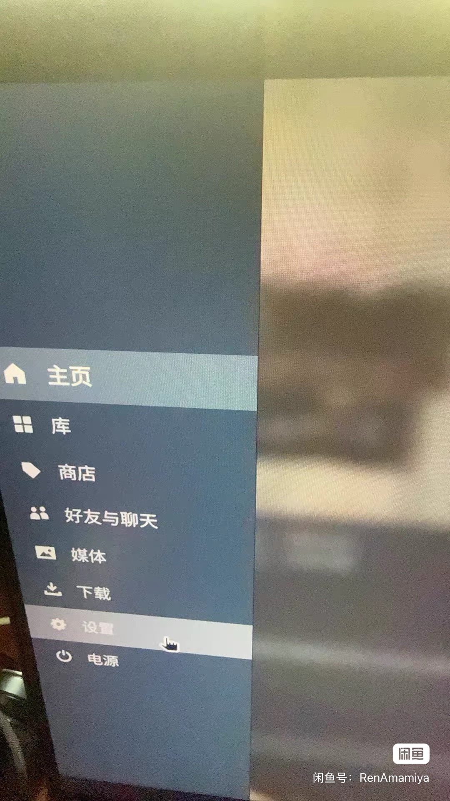
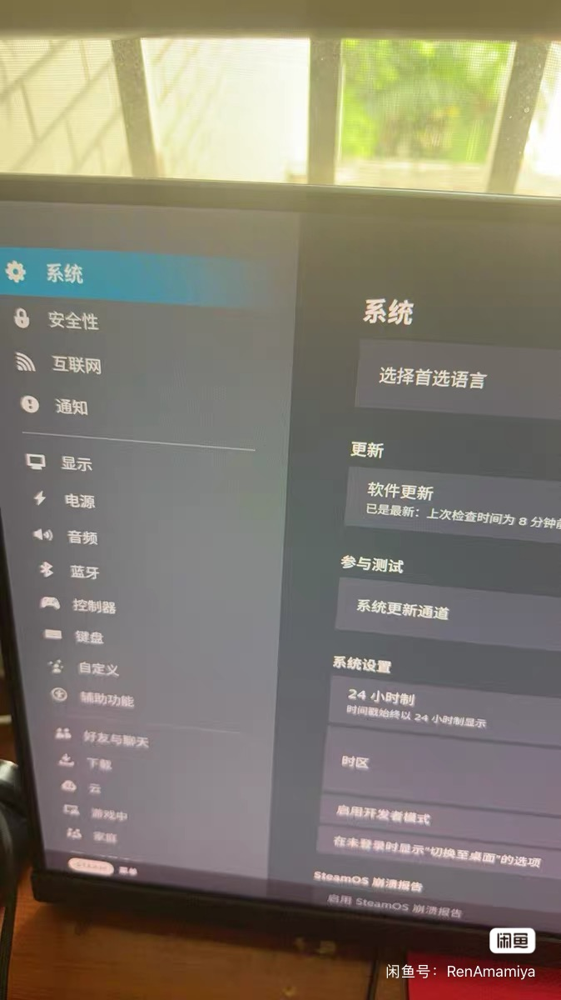
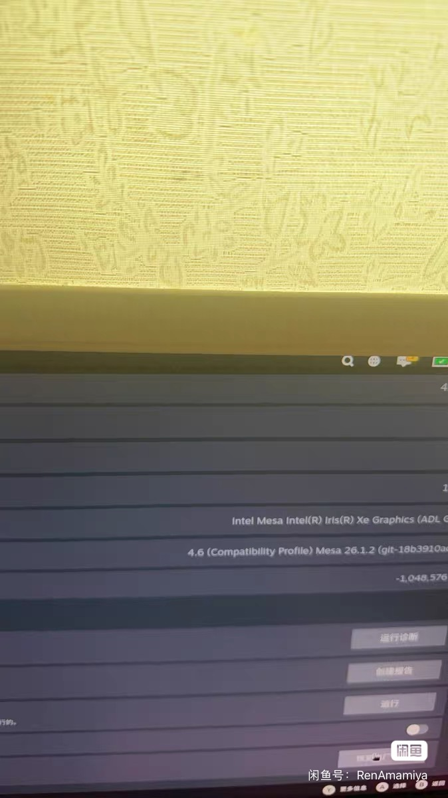

# Steam Deck 忘记密码／重置密码教程

忘记 SteamOS 桌面模式管理员密码时，可根据设备情况选择下面一种方法。

## 方法一：恢复出厂设置（无需键盘）

> **重要：恢复出厂设置会清除设备上的账号、游戏、文件和设置。请先备份重要数据。**

不知道怎样进入游戏模式？如果当前在桌面模式，双击桌面的 `Return to Gaming Mode` 图标即可返回游戏模式。

1. 进入 Steam Deck 游戏模式，按机身上的 `Steam` 键。
2. 点击“设置”。

3. 在设置左侧选择“系统”。

4. 将右侧页面滑到最底部，点击“恢复出厂设置”。
5. 按屏幕提示确认，等待设备完成重置并重新进入初始设置。

## 方法二：保留数据重置密码（需要键盘）

感谢 B 站 UP 主“灵翼”分享此方法与教程。

如果不想恢复出厂设置，并且手边有可连接 Steam Deck 的实体键盘，可参考下面的外部教程：

[打开方法二：Steam Deck 忘记密码解决教程](https://deck.mhhf.com/?p=2383)

方法二涉及启动菜单和命令操作。请严格按照教程执行，不要输入教程之外的命令；如果不确定，建议先备份数据或寻求熟悉 Linux 的人员协助。
