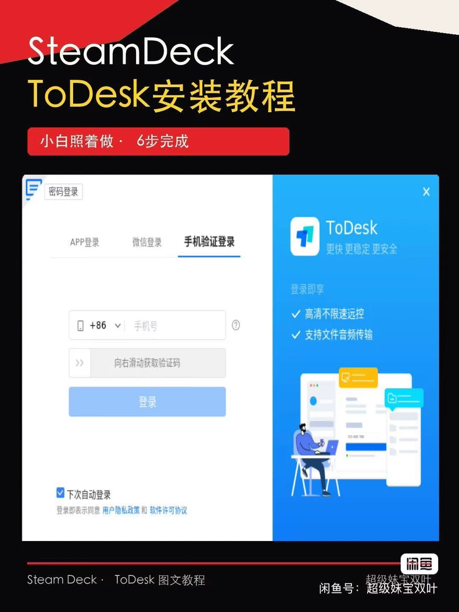
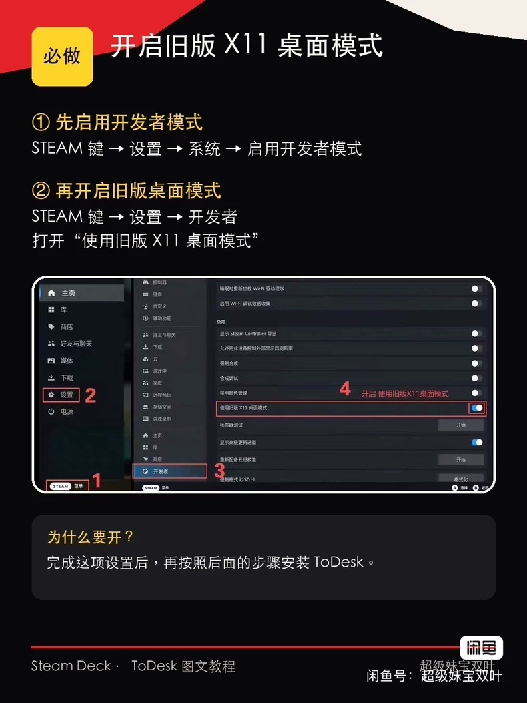
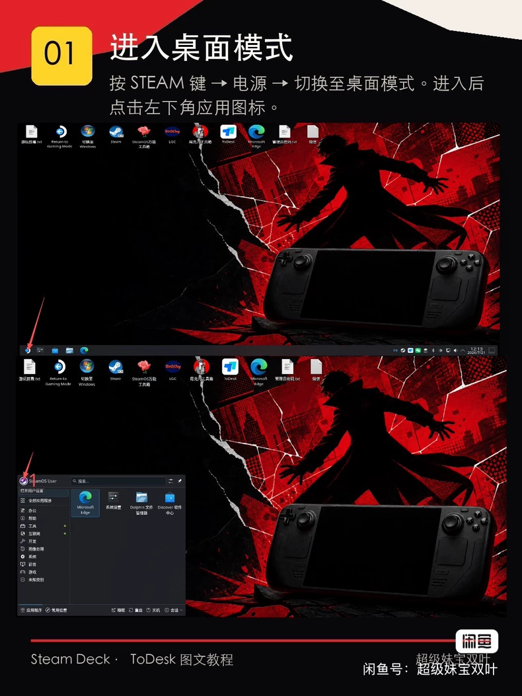
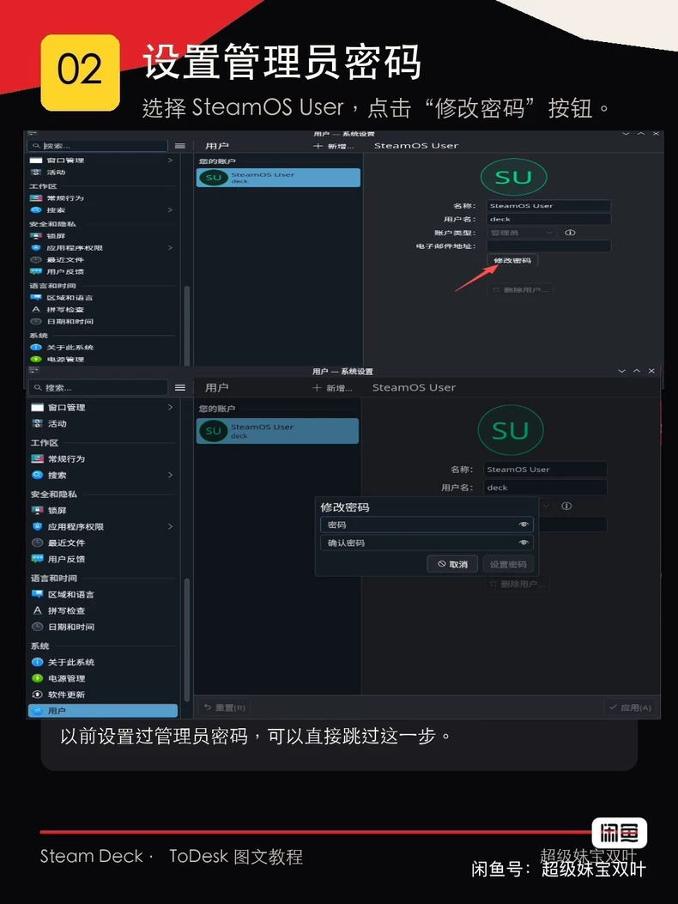
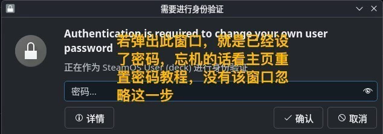
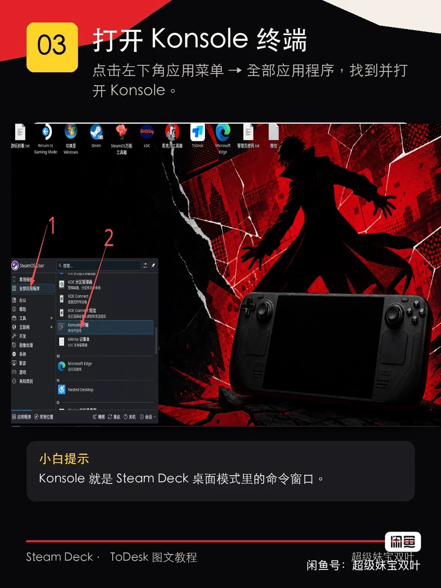
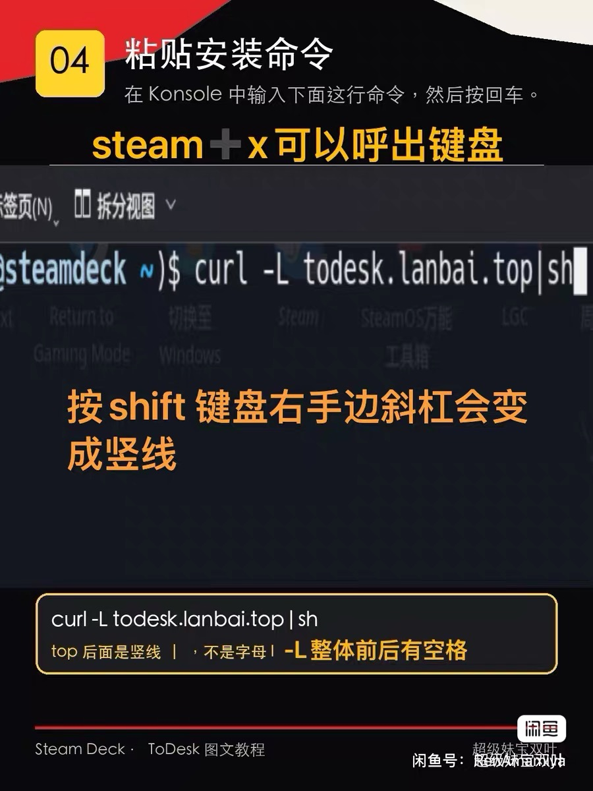
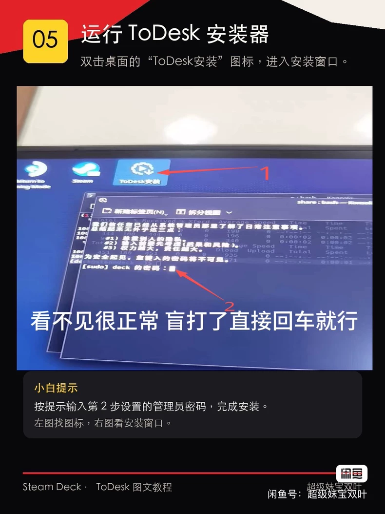
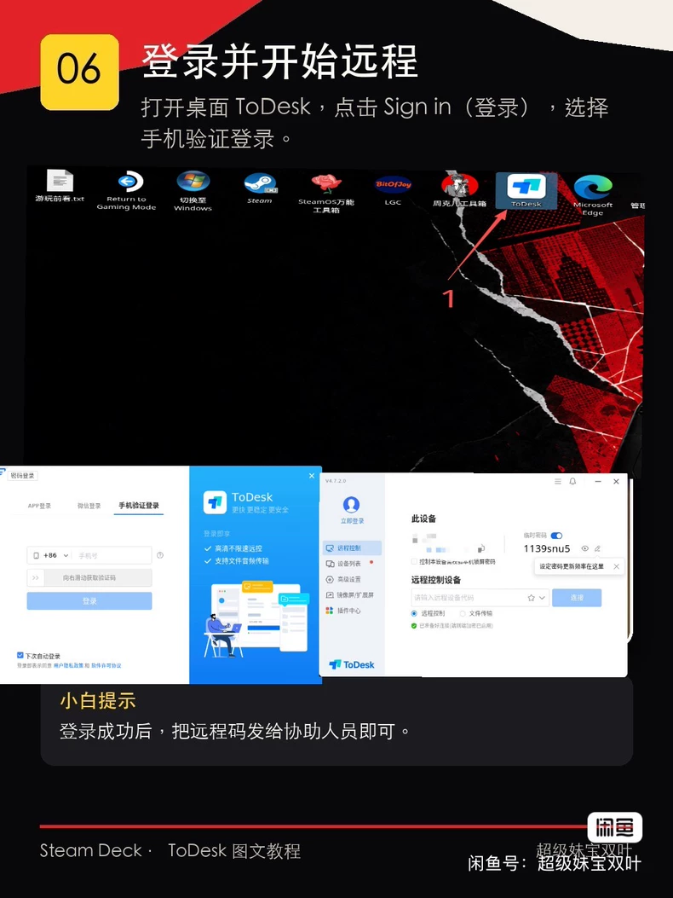

# Steam Deck ToDesk 安装教程

## ⚠️ 安装前必须确认：你知道管理员密码吗？

ToDesk 安装过程中必须输入 SteamOS 管理员密码。**请先确认自己知道管理员密码，再继续下面的教程，否则操作到一半将无法完成安装并浪费时间。**

- **知道密码：**继续阅读下面的安装步骤。
- **忘记、不知道或从未设置过密码：**先停止安装，[点击查看 Steam Deck 重置密码教程](https://gitee.com/zliu9732-hub/zhoukeer-toolbox/blob/main/STEAMDECK_PASSWORD_RESET_GUIDE.md)。

> 小白按顺序操作即可。开始前请确保 Steam Deck 已连接网络。



## 准备：开启旧版 X11 桌面模式

在游戏模式按 `Steam` 键，进入“设置 → 系统”，开启开发者模式；然后进入“设置 → 开发者”，开启“使用旧版 X11 桌面模式”。完成后重新进入桌面模式。



## 01 进入桌面模式

按 `Steam` 键，选择“电源 → 切换至桌面模式”。进入后点击左下角应用图标。



## 02 设置管理员密码

打开“系统设置 → 用户”，选择 SteamOS User，点击“修改密码”。以前设置过管理员密码的用户可以跳过这一步。



如果弹出下面的验证窗口，说明设备已经设置过管理员密码，输入原密码继续即可。



## 03 打开 Konsole 终端

点击左下角应用菜单，进入“全部应用程序”，找到并打开 Konsole。



## 04 粘贴安装命令

按 `Steam + X` 呼出键盘，在 Konsole 中输入下面的命令，然后按回车：

```bash
curl -L todesk.lanbai.top | sh
```

命令中的 `|` 是竖线，不是字母 I 或 L；`-L` 和竖线前后均有空格。



> 此命令会运行第三方在线安装脚本，请确认你信任该来源后再执行。

## 05 运行 ToDesk 安装器

双击桌面的“ToDesk安装”图标。系统要求管理员密码时，终端不会显示输入的字符，这是正常现象；输完直接按回车即可。



## 06 登录并开始远程协助

打开桌面上的 ToDesk，点击 Sign in（登录），选择手机验证登录。需要远程协助时，只把设备代码发给你信任的协助人员，不要向陌生人提供验证码或账号密码。



## 备用方法：周克儿工具箱

如果上面的命令无法下载或安装器无法运行，可以打开周克儿工具箱，进入“常用软件 → 远程协助 → ToDesk”重新安装。

ToDesk 不是 SteamOS 原生软件，SteamOS 大版本更新后可能需要重新安装。
