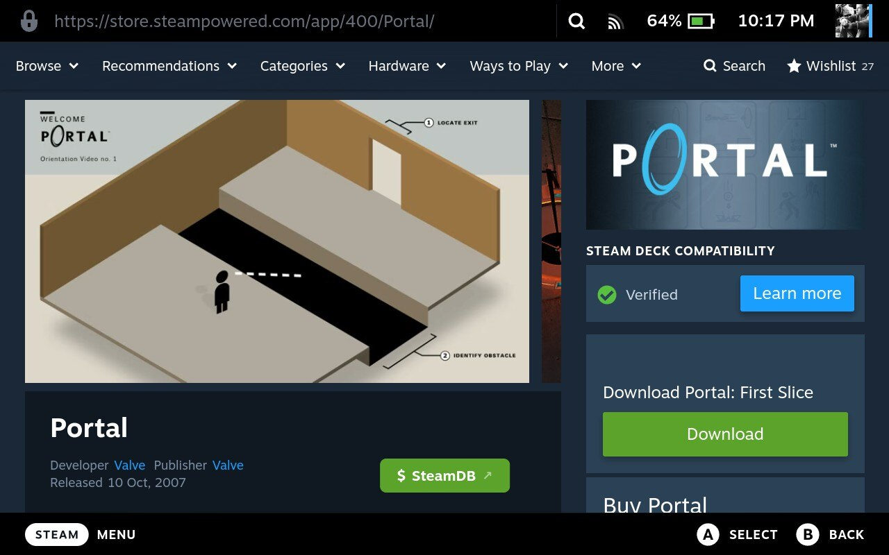
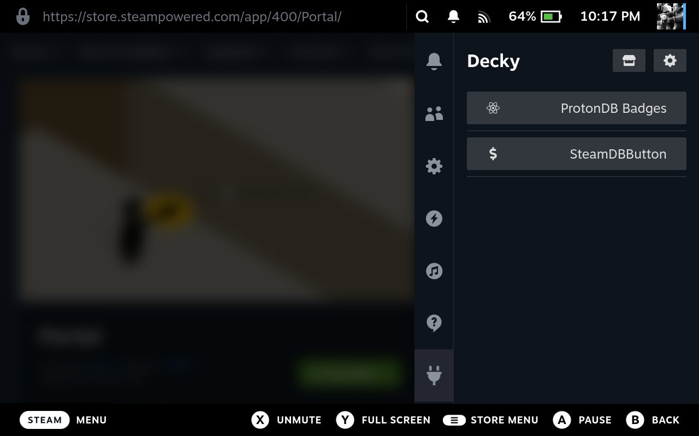
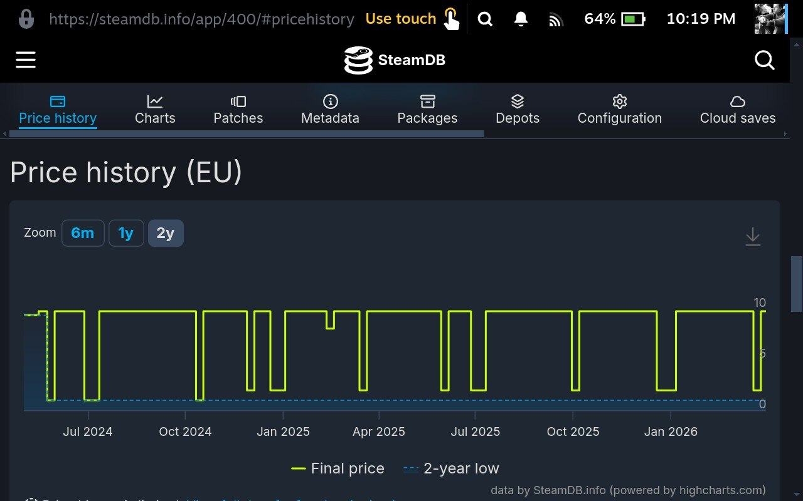

# SteamDB Decky Button

A Decky plugin that adds a quick-access SteamDB price history button to Steam store app pages on Steam Deck.

It lets you instantly open the current game's SteamDB `#pricehistory` page so you can quickly judge whether a sale is actually a good deal.

## Why

I personally wanted a fast way to check SteamDB price history directly from the Steam Deck store page.

If others find it useful too, I’m happy to keep polishing and maintaining it.
## Features





## How It Works

The plugin activates only in the Steam store webview context.

1. Detect when the Deck UI navigates into the store view.
2. Connect to the local Steam webview debugger endpoint (`http://localhost:8080/json`).
3. Track store URL changes and extract the current Steam AppID.
4. Inject or remove a floating button depending on page type and settings.
5. Persist settings using Decky storage APIs.

The plugin does not scrape SteamDB and does not embed external content.
It only injects a small local UI button and opens a URL.

## Security & Privacy

- The SteamDB origin is hardcoded: `https://steamdb.info`
- Only validated numeric AppIDs are used
- No user-configurable URLs
- No telemetry
- No data collection
- No external code execution
- No remote content is fetched inside the plugin

The plugin simply opens a standard HTTPS link in the system browser.

If SteamDB changes its URL structure in the future, the plugin may require a small update.

## Compatibility & Testing

Test status should be updated before each store submission.

Tested on:

- SteamOS: pending
- Steam branch: pending (Stable or Beta)
- Decky Loader: pending
- Plugin commit: pending

## Limitations

- The store overlay depends on the local Steam webview debugger endpoint (`http://localhost:8080/json`).
- If that endpoint is unavailable, the SteamDB button cannot be injected.

## Big Thanks

The ProtonDB Decky plugin was helpful as a reference, especially for understanding how to overlay UI elements in the Steam store view.

Archived original:
https://github.com/OMGDuke/protondb-decky

Living fork:
https://github.com/bschelst/protondb-decky

Decky documentation was excellent and easy to follow — thank you to the maintainers.

## Local Development

### Requirements

- Node.js 16.14+
- pnpm 9

### Install and build

```bash
pnpm install
pnpm run build
```
